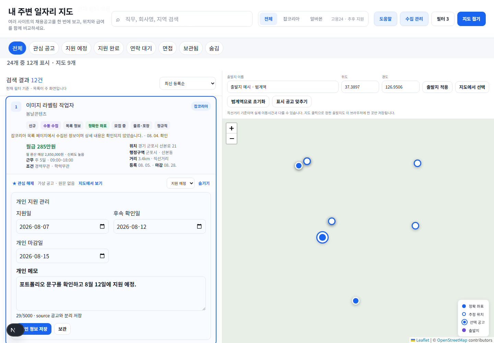
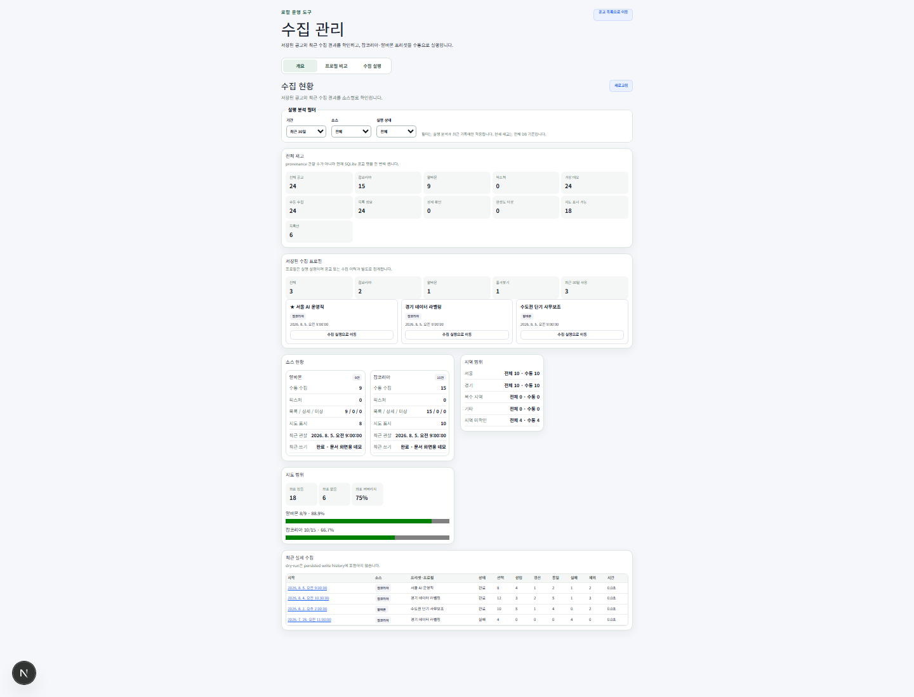
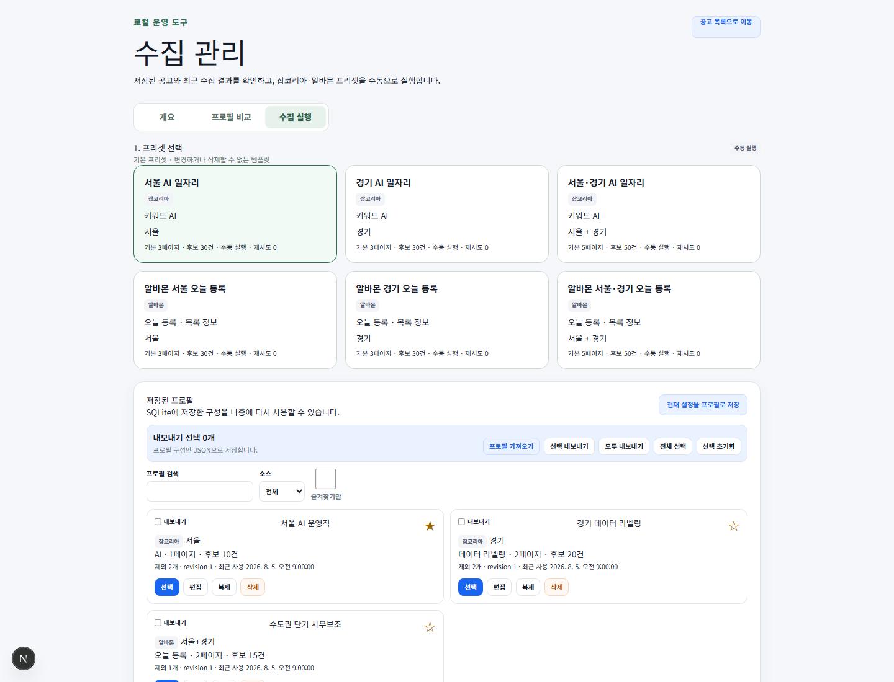
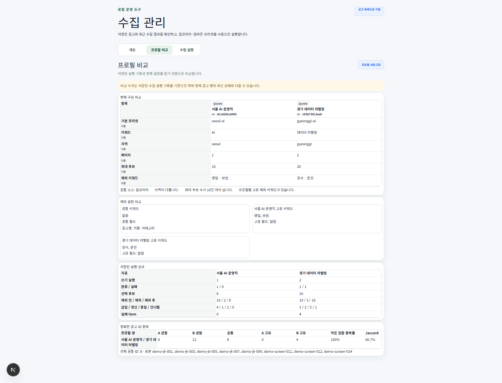
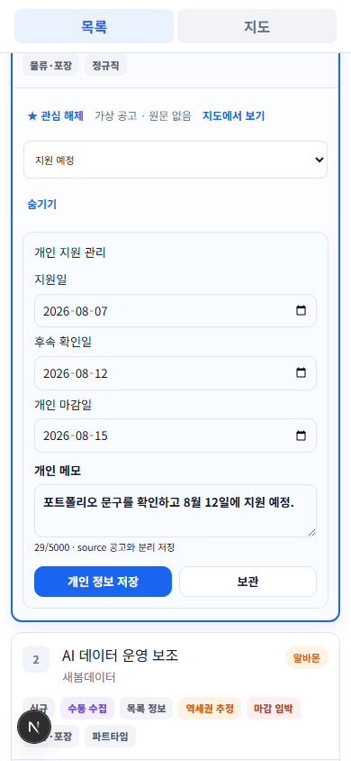
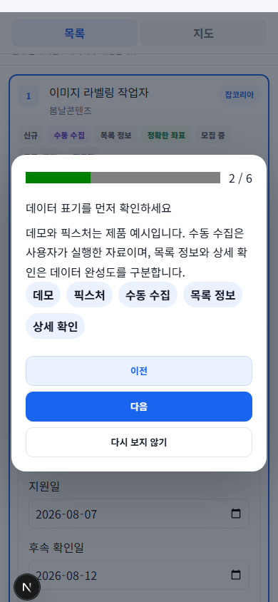

# NearbyJobsMap

## 내 주변 일자리 지도

NearbyJobsMap is a local-first Korean job discovery and application workspace. It keeps a unified job list in SQLite, uses a map as a secondary exploration tool, and provides bounded, manually initiated collection operations for supported source adapters.

> **Status: local MVP.** This repository is not an official API client or a hosted service. Collection permissions remain unverified and users must review source terms and applicable rules themselves.

## Current status and limitations

- Collection is manual only. There is no scheduler, recurring worker, automated login, CAPTCHA bypass, cookie reuse, stealth, or proxy rotation.
- JobKorea public search-page listing collection and listing-only fallback are implemented. Anonymous detail responses may return login or verification content, so many collected records remain explicitly labeled as listing-only.
- The Albamon listing adapter is implemented, but public browser transport has not been confirmed to work in every environment. This project does not call undocumented Albamon BFF endpoints or crawl Albamon detail pages.
- Seoul and Gyeonggi classification is performed locally from visible listing locations. Unknown locations are not guessed.
- Source permission is `unverified`; the project does not grant collection permission.
- Work24 integration is deferred.

## Features

### Job discovery

- Responsive unified list with a supplementary Leaflet/OpenStreetMap view
- JobKorea and Albamon source filters plus provenance, completeness, region, status, salary, location, and map filters
- Seoul/Gyeonggi normalization while preserving original location text
- Positive search and source-neutral exclusion keywords
- Synchronized list counts and map markers; jobs without coordinates remain usable in the list

### Collection operations

- Local-only `/collection` control screen with built-in bounded presets
- Dry-run before write, opaque 30-minute authorization, and exact typed write confirmation
- One active run maximum, concurrency maximum 2, and zero retries
- Progress polling, persisted write history, dashboard analytics, and bounded failure summaries
- No arbitrary URLs, commands, SQL, source keywords, or environment variables through the control API

### Collection profiles

- SQLite-backed saved profiles with revisions, deterministic configuration hashes, favorites, duplication, and optimistic concurrency
- Two-to-four profile configuration and persisted-result comparison
- Preview-first, transactional JSON import/export with conflict-safe create, skip, rename, and replace actions

### Personal job search

- Favorite, hidden, and archived states stored separately from source data
- Workflow states from unreviewed through planned, applied, interview, offer, hired, rejected, and ignored
- Plain-text notes plus application, follow-up, and personal-deadline dates
- Saved filter views and first-run onboarding

### Data operations

- Append-only bounded observations and field-level change history
- First/last-seen and not-observed freshness labels; stale never means closed
- SQLite backup, verification, pre-restore backup, and guarded restore

## 화면 미리보기

화면 이미지는 외부 사이트에서 가져온 실데이터가 아닌, 프로젝트의 정제된 데모 데이터로 생성되었습니다. 캡처 과정은 격리된 임시 SQLite 데이터베이스를 사용하고 모든 외부 브라우저 요청을 차단합니다.

### 공고 목록과 지도



### 수집 현황과 실행





### 저장 프로필 비교



### 개인 구직 관리



### 첫 실행 안내



재생성 및 검토 절차는 [스크린샷 가이드](docs/SCREENSHOTS.md)를 참고하세요.

## Architecture

- Next.js 16.3 App Router and React 19
- Strict TypeScript and Tailwind CSS 4
- Local SQLite with append-only migrations and server-only repositories
- Isolated JobKorea and Albamon source adapters
- Playwright only for bounded rendering of normal public pages
- In-memory, manual-only collection run manager
- No cloud database, account system, telemetry, or required hosted service

See [Architecture](docs/ARCHITECTURE.md) for boundaries and data flow.

Key directories:

```text
src/app/             Next.js pages and local APIs
src/components/      List, map, collection, onboarding, and workspace UI
src/db/              SQLite migrations, repositories, and ingestion services
src/server/          Server-only run, profile, dashboard, and backup services
src/sources/         Isolated source adapters and sanitized fixtures
src/tests/           Offline tests using temporary SQLite databases
scripts/             Database, backup, release, and Windows launcher tools
docs/                Public installation, troubleshooting, and architecture guides
```

## Requirements

- Windows 10 or Windows 11
- Windows PowerShell 5.1 or PowerShell 7
- Node.js 20.9 or newer (the clean validation environment used Node 24)
- npm 10 or newer
- Playwright Chromium only when manual collection is enabled
- Project storage for dependencies, SQLite data, and optional backups

## Windows quick start

1. Clone or download this repository.
2. Open PowerShell in the project directory.
3. Install and initialize:

   ```powershell
   .\scripts\install.ps1
   ```

4. Start locally:

   ```powershell
   .\scripts\start.ps1
   ```

5. Open <http://127.0.0.1:3000>.

Collection execution stays disabled unless `-EnableCollectionUI` is explicitly supplied.

Manual npm setup remains available:

```powershell
npm.cmd ci
Copy-Item .env.example .env.local
npm.cmd run setup:local
npm.cmd run typecheck
npm.cmd run dev -- --hostname 127.0.0.1 --port 3000
```

For details, see [Windows installation](docs/WINDOWS_INSTALL.md).

## Environment variables

Copy `.env.example` to `.env.local` and adjust only local values:

```dotenv
NEARBY_JOBS_DB_PATH=./data/nearby-jobs.sqlite
NEARBY_JOBS_ENABLE_COLLECTION_UI=0
HOSTNAME=127.0.0.1
PORT=3000
NEARBY_JOBS_BACKUP_DIR=./data/backups
```

`NEARBY_JOBS_ENABLE_COLLECTION_UI=1` enables execution endpoints only when the request is also local and passes the existing origin checks. It does not make collection public.

## Database and demo data

The runtime database defaults to `data/nearby-jobs.sqlite` and is ignored by Git.

```powershell
npm.cmd run db:init
npm.cmd run setup:local
npm.cmd run db:status
```

`setup:local` applies migrations and idempotently loads six sanitized fixture-derived records and ten explicitly fictional demo records. Fixture, demo, listing-only collection, and detail-complete collection remain visibly distinct.

To replace a local database with deterministic demo data, first back it up, then use the exact confirmation:

```powershell
npm.cmd run db:reset:demo -- --confirm "RESET LOCAL DATABASE"
```

Never use reset when you intend to preserve an existing database.

## Collection safety

- Manual initiation only; no scheduler or automatic retries
- JobKorea listing maximum 5 pages and candidate maximum 50; detail concurrency maximum 2
- Albamon listing maximum 5 pages and candidate maximum 50; no detail requests in the current phase
- No authentication, cookie/session reuse, access-control bypass, CAPTCHA solving, or stealth
- Dry-run writes no collection run, item, provenance, or job data
- Write requires the matching recent dry-run and exact confirmation
- Failed candidates are not replaced after selection

Collection examples and controls are documented in the application. Review source rules and obtain any required permission before enabling them.

## Backup and restore

```powershell
.\scripts\backup.ps1
.\scripts\backup.ps1 -List
.\scripts\backup.ps1 -Verify -File "nearby-jobs-20260806T120000Z.sqlite"
.\scripts\restore.ps1 -File "nearby-jobs-20260806T120000Z.sqlite" -Confirm "RESTORE DATABASE"
```

Restore verifies the SQLite header, integrity result, manifest, and SHA-256 checksum; creates a pre-restore backup; and requires the exact phrase `RESTORE DATABASE`. Stop the application before restoring.

## Testing and release checks

```powershell
npm.cmd run typecheck
npm.cmd run lint
npm.cmd test
npm.cmd run build
npm.cmd run db:status
npm.cmd run release:audit
.\scripts\release-check.ps1
```

Automated tests use temporary databases and must never access JobKorea or Albamon.

## Public-data and legal notice

Users are responsible for complying with third-party terms, robots policies, applicable law, and data-use permissions. This project does not grant permission to collect from any service and includes no access-control bypass. Do not commit personal data, credentials, cookies, private notes, runtime databases, raw source pages, or profile exports.

## Roadmap

- Owner-reviewed v0.1.0 release publication
- Simpler Windows distribution and signed launcher experience
- Optional source integrations only after permission and contract review
- Public GitHub release after repository review

No dates are promised.

## License

Licensed under the [MIT License](LICENSE).

## Contributing

See [CONTRIBUTING.md](CONTRIBUTING.md).

## Security

See [SECURITY.md](SECURITY.md).
