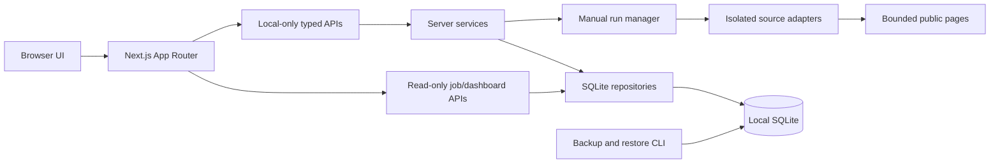

# Architecture

NearbyJobsMap is a local-first Next.js application. The job list is the primary product surface; the map is a derived secondary view.

## Browser and client components

Client components render jobs, filters, map markers, collection progress, onboarding, profiles, personal workflow state, and saved views. They consume typed application models and do not parse source pages or import SQLite drivers.

## Server components and APIs

App Router handlers validate bounded JSON and origin/locality rules before calling services. Collection handlers never duplicate crawler logic or shell out to CLI parsers. Dashboard and comparison routes are read-only and do not trigger source access.

## SQLite repositories

Server-only repositories own SQL and use parameterized statements. Migrations are append-only. Exact job identity is `(source, sourcePostingId)`; provenance observations, ingestion items, user state, saved profiles/views, and observation history are separate tables.

Tests create unique temporary databases and never open `data/nearby-jobs.sqlite`.

## Source adapters

JobKorea and Albamon adapters are isolated behind shared collection contracts. Parsers are network-free. Transport is bounded, manual-only, cookie-free, and cannot be invoked by build, migrations, seed, CI, or dashboard reads.

## Run manager

The in-process manager allows one active manual run. Dry-run state and write authorization are opaque, short-lived, and in memory. Write requires a matching dry-run configuration and typed phrase. There is no scheduler, queue, cron, or recurring worker.

## Profiles and analytics

Saved collection profiles have opaque IDs, optimistic revisions, and deterministic configuration hashes. Persisted write runs retain immutable profile snapshots. Profile comparison and dashboard analytics aggregate bounded persisted data without fuzzy cross-source identity matching.

## Personal workflow

Favorites, workflow states, notes, dates, hidden/archive state, and saved views are user-owned local data. They never overwrite source lifecycle or provenance.

## Observations and changes

Observations store bounded normalized fields, hashes, status, completeness, and timestamps—never raw HTML or full descriptions. Field diffs are append-only. Not observed/stale labels do not assert closure.

## Backups

The backup service uses SQLite's backup API, SHA-256 manifests, integrity checks, project-local path confinement, pre-restore backup, and post-restore verification. Generated files are ignored.

## Security boundaries

- Collection UI and profile/workspace mutation APIs are localhost-only and feature-flagged.
- The default launcher binds to `127.0.0.1` with collection disabled.
- No authentication system is used to expose collection publicly.
- Import/export contains configuration only; backup contains local SQLite data and must be protected by the user.
- No telemetry, cloud database, source credentials, access-control bypass, or automatic update download exists.
